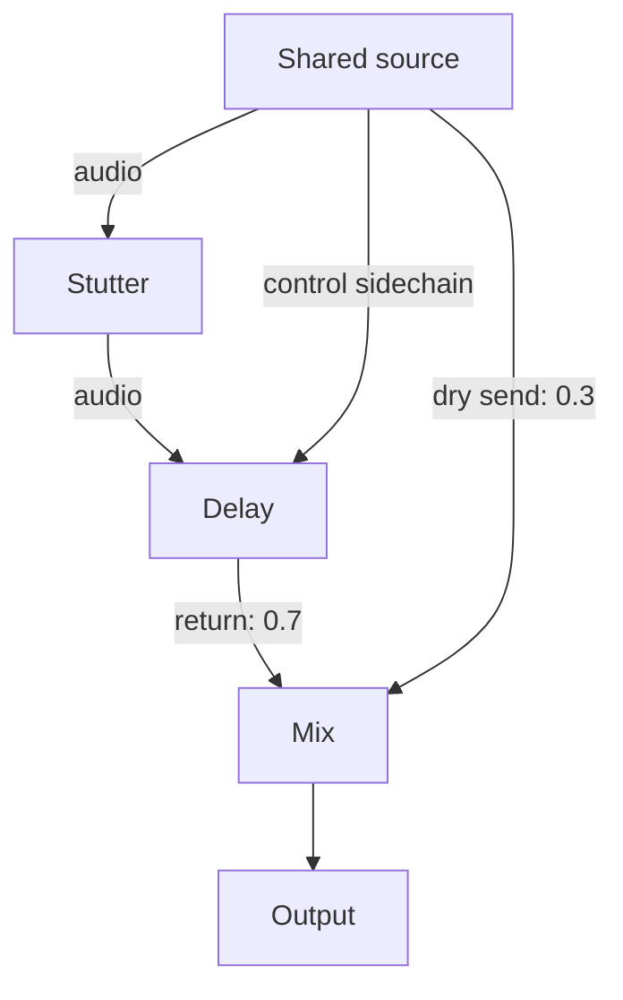

# FX engine: runtime, routing and verification

The FX workbench evaluates an ordered audiovisual graph against prerecorded media. Its audio backend produces deterministic stereo PCM; its visual backend evaluates picture, text and matte streams at an output-clock position. The same saved patch supplies parameters, routes, source binding, seed and automation to both.

The first source bundle is the **95.0–107.166667 second passage from God's Ears**: 292,000 stereo audio frames at 24 kHz and 146 picture samples at 12 fps. The original recording and the inherited DeepFilterNet dialogue candidate remain separately selectable. That candidate has not acquired artist or human-listening acceptance merely by becoming an FX input.

This is a working excerpt-based instrument. Its audio processing, routing, replay and export are implemented. It does not recover isolated performer recordings, certify transcription, complete final rotoscoping or establish the artistic success of a preset.

## Runtime responsibilities

| File or component | Responsibility |
|---|---|
| [`web/fx/catalog.mjs`](../web/fx/catalog.mjs) | Thirteen module definitions, supported targets, parameter bounds, macros and presets. |
| [`web/fx/core.mjs`](../web/fx/core.mjs) | Patch factories, schema-oriented validation, graph ordering and shared parameter evaluation. |
| [`web/fx/audio-engine.mjs`](../web/fx/audio-engine.mjs) | Stereo DSP, audio/control graph evaluation, time-map helpers, WAV codec and optional control-lane export. No browser or Node-specific dependency. |
| [`web/fx/audio-worker.mjs`](../web/fx/audio-worker.mjs) | Browser adapter that receives decoded input and a patch, then returns rendered PCM and requested control lanes. |
| [`web/fx/visual-engine.mjs`](../web/fx/visual-engine.mjs) | Random-access Canvas 2D composition of upstream picture, text and matte signals. A supplied canvas factory enables an offline renderer to use the same code. |
| [`web/fx/app.mjs`](../web/fx/app.mjs) | Transport, rack editing, graph editing, automation recording, patch import/export, monitor selection and viewport presentation. |
| [`web/fx/assets/manifest.json`](../web/fx/assets/manifest.json) | Excerpt duration, picture/matte atlas addressing, audio assets and source-clock relationships. |
| [`web/fx/assets/provenance.json`](../web/fx/assets/provenance.json) | Source hashes and the qualifications attached to dialogue, cue, matte and room inputs. |

The rack is an additional surface under `web/fx/`. It does not replace the older Python renderer or `web/index.html` score edition. Their implementations and acceptance records remain separate.

## Signal graph

A patch stores nodes and typed connections. Sources, processors, mix nodes and outputs are explicit. In this backend, every source node reads the same decoded excerpt supplied to `renderAudio`; declaring additional source-node names does not create independent recordings.

```js
{
  from: 'word-stutter',
  to: 'echo-return',
  port: 'audio',
  gain: 1,
  role: 'insert'
}
```

The connection types have different meanings:

| Port | Material carried | Important boundary |
|---|---|---|
| `audio` | Stereo sample buffers. | A named actor region does not separate that actor's voice from the shared recording. |
| `picture` | Source/composited image samples. | A crop or region can be independently processed without being a clean body extraction. |
| `text` | Expressive word material. | It is separate from accessibility captions and may be authored rather than performed text. |
| `matte` | Categorical/alpha material used to select bodies, room or other supported areas. | Retiming a body requires the matte from that same body source time. |
| `control` | A unipolar modulation signal. | It changes an explicitly assigned parameter; it is not mixed into the audio bus. |

`insert`, `send` and `return` describe the role of an explicit cable. They do not create implicit buses. A serial processor accepts one input per port; use a mix node for multiple inputs. Audio mix and output nodes sum the declared gains. A control cable uses `role: 'sidechain'`.

For example, a dry branch can run beside a Stutter → Delay return:



Every processor reads the **actual upstream result**. Capturing at 2.88 seconds after a Delay captures that Delay's output at 2.88 seconds; it does not silently reopen the original movie at that position. Stutter → Delay therefore differs from Delay → Stutter. The tests verify this difference with signal data.

Graph cycles are rejected. Feedback recurrence is internal to the Feedback processor, where explicit sample delays and bounded return generations make its behavior finite. Connecting an output cable back into an earlier graph node is not a substitute for that processor.

Validate imported patches with `validatePatch`, including the known source binding and project regions, before rendering. The low-level audio engine rejects missing/duplicate node IDs, unknown nodes, invalid graph cycles and multiple direct audio inputs to one processor; it is not a replacement for the complete project/schema validator.

## Wet/dry and Intensity are independent

For an active audio insert, the final blend is:

\[
y = (1-w)x + wF(x; P(I)),
\]

where `w` is wet, `I` is Intensity, and `P(I)` is the set of parameters produced by the editable macro. There is **no extra multiplication of wet by Intensity**.

- `wet: 0` passes the incoming stream through exactly.
- `wet: 1` emits the processor result at any Intensity.
- `intensity: 0` selects the macro's authored minimum endpoints. Those endpoints can remain strongly expressive.
- An empty macro means Intensity has no parameter destinations. Moving it must not change wet/dry or add reference dialogue.
- Bypass, an inactive clip scope, an unselected voice target or exclusion by solo passes the appropriate incoming stream through.

Bypass has no automatic latency compensation. An authored echo delay remains a delay; bypass emits the input at the current output position. To keep a tail after another component closes, wire a separate return around that component.

Delay's fully wet path contains delayed returns only. Direct dialogue requires the wet/dry control or a visible parallel dry branch. Feedback includes a processed current injection as the source of its recursive generations; that is part of the effect, not an undeclared reference track.

### Evaluation order

The core and audio backend use the same parameter precedence:

1. Evaluate common Intensity/wet keyframes and applicable recorded events.
2. Bound the common values, apply their sidechain mapping, and bound again.
3. Map Intensity through each macro's endpoints and curve.
4. Apply direct parameter keyframes and applicable recorded events over the macro result.
5. Bound/round the parameter, apply its sidechain mapping, and bound/round again.
6. Apply bypass, solo and the half-open clip scope `[start, end)` when deciding whether the insert contributes.

Supported macro curves are linear, ease-in, ease-out and smoothstep. A lane holds its first/last keyframe values outside its keyframe span. At the same timestamp, the last applicable recorded event wins. A recorded event continues to override that parameter's lane until another applicable event replaces it.

Sidechain `add` means `value + amount × control`; `multiply` means `value × (1 + amount × control)`. Integer parameters round **before and after** this mapping. For example, a macro value of 2.4 rounds to 2; adding 0.4 then rounds to 2 again. Rounding only the final 2.8 to 3 would disagree with the shared evaluator.

### Level handling

`outputGain` is a separate authoring level. After graph evaluation, peak handling attenuates the complete expressive render only if its peak exceeds `peakTarget` (default 0.92). It does not raise quiet material to a target loudness. The report records peak before/after, attenuation gain, ceiling and mixing policy.

This is static whole-render peak attenuation, not a look-ahead broadcast limiter or loudness-normalization pass. A preset can alter density, timbre and perceived loudness as a consequence of its processing; those changes are not evidence of improved dialogue quality.

`renderRackAudio` then handles demonstration phases named `bypass` as a **master reference route**. It restores the exact input reference samples after branch summation and attenuation. This prevents parallel dry branches from making a supposedly bypassed demonstration louder or otherwise different. The optional named control lanes describe node control ports before that master-reference replacement.

## The thirteen audio behaviors

| Module | Actual audio implementation | Principal audio controls / qualifications |
|---|---|---|
| **Routing** | Folds the shared stereo input to a common message signal and moves it between normalized left/right addresses using equal-power gains. Travel has forward and return legs. | `travel`, `origin`, `destination`, `spread`. This is stereo addressing, not five independent performer stems or a multichannel spatial-audio renderer. |
| **Delay / Echo** | Finite upstream-input taps at multiples of the selected delay, with decaying gain and alternating stereo positions. The wet path has no immediate direct tap. | `time`, `taps`, `decay`, `spread`. Normalized tap energy controls buildup; it never creates an automatic clean-voice floor. |
| **Stutter** | Captures an upstream interval, repeats it a finite number of times, applies short splice edges and explicit gaps, then returns to the continuing upstream timeline. | `capture`, `window`, `repeats`, `rate`, `gap`, `release`. The current OUT workprint uses capture 2.88 seconds and a 0.24-second window; the boundaries are not listening-certified phoneme edits. |
| **Granular** | Schedules Hann-windowed grains with seeded source scatter, pitch/rate variation, overlap and spatial scatter. | `size`, `density`, `scatter`, `pitch`, `spatial`, `order`. Grain decisions read parameters at each grain onset; common wet blending remains sample-accurate. Visual tiles follow their own authored grain rule. |
| **Reverse** | Reverses finite upstream blocks anchored at the pivot while the output clock continues forward. Route mode keeps forward speech and exchanges stereo destinations. | `span`, `pivot`, `speed`, `mode`. The audio helper accounts for the discrete final sample; the visual helper addresses the corresponding source frame. |
| **Freeze / Hold** | Repeats two overlapping, windowed grains from the captured upstream sound, with decay and release. | `capture`, `duration`, `grain`, `decay`, `release`. This is a granular hold, not spectral reconstruction or a generated sustained performance. Current default capture 2.92 seconds / grain 0.08 seconds selects an audible OUT residue. |
| **Feedback** | Each delayed return generation reads the previous processed generation, crosses stereo channels, applies damping and saturation again, and contributes to a bounded output. | `time`, `gain`, `repeats`, `threshold`, `reset`. Return age, gain, threshold and reset bound state. It is distinct from repeatedly reading unchanged input taps. |
| **Queue / Overflow** | Distinct source windows arrive in a bounded FIFO/LIFO queue. Service releases individual entries; capacity overflow and periodic bursts release groups at a faster playback rate. | `capacity`, `rate`, `release`, `burst`, `spread`, `order`. Default workbench inputs are fixed source windows, explicitly not checked speech units. Authored cue mode is available through a separate input contract. |
| **Gate / Erase** | Applies periodic gain windows or an external-control threshold, with edge smoothing and retained residue. | `detector: 0` selects periodic operation; `detector: 1` selects sidechain threshold. `phase` is a fraction of a cycle. Other controls include `duty`, `period`, `edge`, `threshold`, `retain`. No control cable supplies a zero detector signal. |
| **Displacement** | Applies variable-delay pitch warble and an optional ring-modulation blend to voice-selected input. | `warp`, `frequency`, `ring`. Its audio mapping is authored separately from image deformation; image geometry does not physically derive the sound. |
| **Exchange** | Region-only mode preserves audio. Voice/both modes read delayed shared-channel history and reassign it among alternating stereo addresses with a transition. | `mode`, `interval`, `offset`, `timeOffset`, `transition`. This does not swap isolated actors' voices or claim that anyone performed new dialogue. |
| **Typography** | Passes audio through. Its expressive work occurs in text/picture ports. | Spoken-word cues and authored screenplay words keep distinct provenance. WHY in Correction Machine is authored text, not performed audio from this excerpt. |
| **Signal Damage** | Combines sample-and-hold rate reduction, coarse amplitude quantization, nonlinear drive and bandwidth restriction. | `bits`, `rate`, `drive`, `band`, `output`. The independent output knob is excluded from the default Intensity macro. Export remains PCM16; the effect's resolution control is signal processing, not a lower-bit WAV container. |

The processor names describe operations on supplied material. None of them recognizes a speaker, verifies a word boundary, reconstructs an occluded body or generates plausible lip movement.

## Targets, layers and what is actually independent

The graph can address `voice`, `picture`, `body`, `text`, `objects` and `room`. Their underlying evidence differs.

**Audio:** the supplied soundtrack is one stereo mixture. Selecting voice affects that mixture, even when the module also names a character region. A future stem-aware backend must bind genuine separate source buffers; renaming a source or region is insufficient.

**Bodies and room:** the bundle contains separately addressable visual matte labels for five appearance-defined people. These are guided classical segmentation workprints reduced to categorical 320 × 180 labels. They permit a body-region operation to leave surrounding picture material running, but hair, hands, occlusion, chair overlap and tracking edges remain imperfect. They are not certified identities or accepted final roto.

**Objects:** the current object selection is an authored normalized rectangle/region, not a segmented and tracked glass, stove or other object. Moving the selected rectangle can move background pixels inside it.

**Background fill:** erased or moved body pixels can reveal the hybrid room plate. Its hidden areas are generated fill from the earlier reconstruction study, with approximate registration to this passage. The observed plate instead leaves unknown areas visibly unfilled. Neither is recovered original footage behind the actors.

**Text:** cue-derived text retains provisional ASR status. Authored text is allowed as material, but is not presented as evidence that the word was spoken in the selected recording. Expressive word timing does not automatically create a reliable caption transcript after temporal processing.

Freeze and Reverse demonstrations therefore select the light-gray-shirt body plus voice, without an obstructing text overlay. The visual hold/reversal can be assessed against the moving surrounding scene. Audio still processes the shared mixture.

## Clock, replay and control exchange

Every graph time is measured in **seconds from the excerpt's output origin**, not Unix time, browser startup or the original movie's zero. The patch records source offset 95 seconds separately. Pixel/audio source lookups interpret capture and time-map positions in the upstream stream they receive.

The browser audio transport uses its AudioContext clock. The picture evaluator samples that output position at the media's 12 fps. Audio automation is evaluated at each PCM sample; granular and queue decisions occur at their documented event boundaries. The visual backend is frame-quantized. It cannot show changes shorter than one supplied picture interval.

The worker renders a complete buffer for a patch revision. Editing a control requests another render, and the transport replaces the playable buffer at the current position when ready. This is not an AudioWorklet processing live microphone input sample by sample. Reverse, granular scatter and other operations can read future positions in the prerecorded excerpt, so they are not promised zero-latency streaming effects.

Recorded parameter events, keyframes, seed and node IDs make a saved score replayable. Granular randomness comes from a deterministic seed and node ID; the engine uses no wall clock or ambient `Math.random()`. Rendering does not mutate the source arrays or patch. Under a scheduled bypass, state can still be reconstructed for the later active portion. A new render recomputes history from the beginning rather than depending on the order in which a user scrubbed.

### Share control values rather than approximating them twice

The audio detector's default settings are 6 ms attack, 75 ms release and sensitivity 5. A source control port emits that envelope. A processor or mix with an incoming control cable passes its combined incoming control onward; otherwise its control output is detected from its processed audio.

Request the actual named controls when rendering:

```js
const result = renderRackAudio(patch, referenceChannels, sampleRate, patch.duration, {
  peakTarget: 0.92,
  includeControlEnvelopes: true,
  controlFps: 12,
});

// result.controlEnvelopes: {source: Float32Array, 'fx-1': Float32Array, ...}
// result.controlFps: 12
function controlAt(nodeId, time) {
  const lane = result.controlEnvelopes[nodeId];
  if (!lane?.length) return 0;
  const index = Math.max(0, Math.min(lane.length - 1, Math.floor(time * result.controlFps)));
  return lane[index];
}
```

Lane sample `i` is a point sample at `i / controlFps` seconds; it is not the mean of a frame window. The lane length is `ceil(audioFrames × controlFps / sampleRate)`. The optional rate defaults to 12 and is bounded to 1–240 samples per second. Named controls are returned outside `report`; omitting the option keeps the original `{channels, report}` shape and the same audio values.

Use these lanes for the visual graph's matching node IDs. A waveform thumbnail with a different scaling factor is not the same detector. A matching source detector alone is also insufficient when a control cable originates after an audio effect. During a demonstration's master bypass, visual and audible output bypass the rack; node lanes continue to describe the evaluated graph before that master replacement.

### Queue cue contract

The current browser/offline default deliberately omits cue inputs, using distinct fixed source windows. `assets/cues.json` remains text evidence. If a later composition deliberately queues phrase selections, adapt each one to:

```js
{id: 'u06', start: 2.4, end: 3.76, arrival: 3.76}
```

Pass that array as `options.cues` or `options.events`. These options mean source-arrival material; `patch.events` means recorded parameter changes. The existing phrase bank uses `in` and `out`, so raw phrase objects must be translated before use. The current image Queue and audio Queue use independently reconstructed histories; shared controls do not make their event schedules identical.

## Audio API

| Export | Purpose |
|---|---|
| `renderAudio(patch, channels, sampleRate, duration, options)` | Evaluate the graph and return stereo PCM plus its report. Optional named controls are returned when requested. |
| `renderRackAudio(...)` | Same graph evaluation plus exact-reference master bypass for demonstration phases. Use this in the worker and offline workbench renderer. |
| `processAudioModule(type, channels, sampleRate, node, context)` | Evaluate one insert from its actual upstream buffer. |
| `amplitudeEnvelope(channels, sampleRate, options)` | Produce the full-rate source/control detector envelope. |
| `encodeWav(channels, sampleRate)` | Return an ArrayBuffer containing stereo PCM16 WAV. |
| `decodeWav(bytes)` | Decode PCM16/24/32 or IEEE Float32 WAV to channels, sample rate and duration. |
| `stutterSourceTime`, `reverseSourceTime`, `freezeSourceTime`, `routingPosition` | Shared deterministic temporal/spatial helpers. A null Stutter time denotes its explicit gap. |
| `sampleAutomation`, `topologicalAudioOrder`, `readSample`, `AUDIO_MODULES` | Low-level curve, graph, sample and module utilities. |

The main options are `peakTarget`, `outputGain`, `bypass`, `controlSource`, `cues`/`events`, `includeControlEnvelopes`, `controlFps` and optional catalog `parameterDefinitions`. `controlSource` is a full-audio-rate array; exported visual lanes are downsampled outputs and should not be passed back as a full-rate source without resampling.

Use two Float32Array input channels. Mono input is duplicated. Requested output duration determines sample count; the low-level engine pads absent input positions with zero and rejects an in-memory request over 30 minutes. That guard is not a claim that an arbitrarily large graph will fit in a device's memory.

The pure renderer accepts decoded samples and does not read files or verify a movie hash against those samples. The caller must check the asset binding and record whether original or candidate dialogue supplied the buffers. The actual-source render report records both source provenance and the selected WAV hash.

## Run and verify

The audio test/CLI integration uses the existing repository layout and Node's built-in test runner. It was verified with Node 24.19.0 and requires no npm package installation for the audio backend. The separate offline picture renderer uses the Canvas dependency declared in `package.json`.

Serve the browser assets from the repository root:

```bash
python -m http.server 8080 --directory web
```

The FX surface is then under `/fx/`. Serve over HTTP; ES modules, workers and media fetches are not a `file://` workflow. The source atlas pages, WAVs, room images and metadata named in the manifest must be present under `web/fx/assets/`.

Run the audio and shared-core tests:

```bash
node --test tests/fx/audio.test.mjs tests/fx/audio-core.test.mjs
```

Keep the existing project checks:

```bash
python -m unittest discover -s tests -v
node tests/score.test.mjs
```

The existing `npm test` command includes both audio tests through `tests/fx/*.test.mjs`. They can also be added to the command list in `tools/check.py`. Tests import the production files under `web/fx/`; there is one engine implementation.

Render an exported patch to audio:

```bash
mkdir -p outputs/fx
node tools/render-fx-audio.mjs \
  projects/god-here/fx/patches/demo-delay.json \
  web/fx/assets/dialogue-candidate.wav \
  outputs/fx/demo-delay.wav
```

The CLI writes the WAV and `demo-delay.wav.report.json`. It calls `renderRackAudio`, so exported demonstration bypass ranges retain the reference. The application exports patch JSON separately; audio rendering is not a screen recording and does not include picture frames. For audiovisual output, the offline adapter must evaluate `VisualEngine` at the declared frame times and mux the matching audio, preserving the source clock and patch revision.

## Verification evidence and limits

The audio unit suite contains **29 passing tests**. It covers finite and silent outputs for all modules; exact bypass/wet-zero behavior; fully wet output at low Intensity; effectful macro minimums; no hidden direct Delay tap; serial order dependence; seeded replay; independent parallel sends/returns; sidechains and integer rounding; clip boundaries; recorded bypass/solo; distinct Queue arrivals; Feedback recursion/reset; peak attenuation; source gain; graph errors; WAV roundtrip; and optional named control lanes without changing default output.

The shared-core integration test compares actual audio samples with independently evaluated canonical node snapshots at **14 output positions / 28 channel comparisons**. The observed maximum difference was zero. Its selected cases cover macro curves, common/parameter automation, event precedence, sidechain addition, bounds and clip edges. This is focused cross-backend evidence, not an exhaustive proof for every possible graph.

The prepared source bundle has **13 module demonstration WAVs plus six expressive patch WAVs**, with saved patches, hashes and reports. Every module demonstration's 0–2 second and 10–end bypass ranges exactly match the reference input, including after PCM16 encode/decode. Default Exchange region mode and Typography intentionally leave the audio unchanged. The final optional-control-lane extension does not alter those PCM results.

These results establish processing behavior, repeatability and specific integration invariants. They do not establish that a word splice is correct, that the candidate dialogue sounds preferable, or that every extreme preset succeeds artistically. Source mattes remain workprints; hidden-room fill is synthetic; picture is sampled at 12 fps; audio and image granular/queue histories are separately authored; image feedback uses bounded accumulated transforms rather than the audio backend's damping/saturation arithmetic. Browser and offline use of the same visual code still depends on canvas/font/media-decoding details.

Physical iPhone/Safari behavior, listening on actual playback equipment, acceptable discontinuities during live patch replacement, final mask contours and artist selection belong in the overall workbench acceptance record. Preserve those distinctions when reporting a successful engine test or render.
